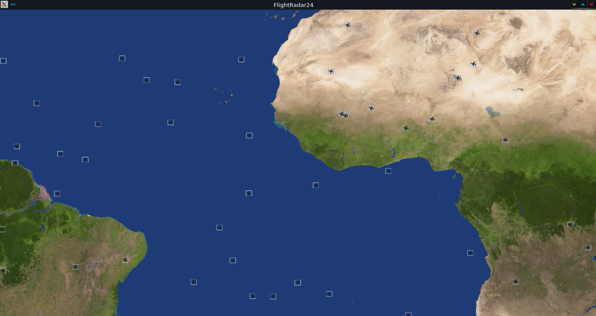

# FlightRadar24-like-simulation


## *flightRadar24 like simulation in C / CSFML also know as my_radar at epitech.*





**help** : ```./my_radar -h```


**USAGE** : ```./my_radar data.txt```

this program take a "map" in argument containing all the information about the tower and plane the formating is the following one :

Aircrafts are described by:

    • The letter ‘A’

    • Two integers corresponding to the departure x- and y-coordinates

    • Two integers corresponding to the arrival x- and y-coordinates

    • One integer corresponding to the aircraft’s speed (in pixels per second)

    • One integer corresponding to the delay (in seconds) before the aircraft takes off.

Control towers are described by:

    • The letter ‘T’,

    • Two integers corresponding to the control tower x- and y-coordinates

    • One integer corresponding to the radius of the tower’s control area (in percentage of the greatest side
    of the screen).

**you can find a "map generator" for this project at** https://github.com/Fosowl/data-generator-for-My_radar-EPITECH-project-
